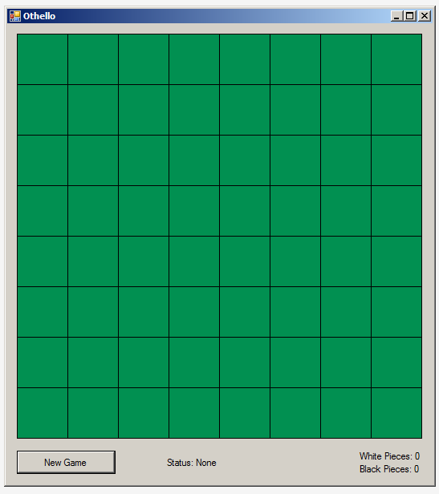

# Assignment 4: Othello (Reversi) GUI App

**Deadline: October 17, 2014, 11:59pm, US Central**

## Tasks

In this assignment, you are to *design* a MVC-style GUI app for a 2-human-player
Othello game (a.k.a., reversi; see http://en.wikipedia.org/wiki/Reversi);
see online tutorial to see how to play (e.g.,
http://www.youtube.com/watch?v=lO2pEK33SSw) or play online at
http://www.ireversi.com.
Similar to Assignment 3 (A3), the game save/load the state of the game using 
Json.NET.

I have provided a starting Windows Form app with the following UI:



The functionality of the app is similar to the one in http://www.ireversi.com,
except that both players are human players.

The form consists of 8x8 board tiles of
[PictureBox](http://www.dotnetperls.com/picturebox)es (stored in a 
multi-dimensional array field named `tileYX` in
`OthelloForm.cs`, with a button to start
a new game (`newButton`) and three labels (`statusLabel`, `whitePiecesLabel`, and
`blackPiecesLabel`) that display the information about the game 
(whose turn it is, etc.), the number of white pieces, and the number of black
pieces, respectively.

When `newButton` is clicked, the board is initialized with white
pieces at (row 3, column 3) and (4, 4) and black pieces at (3, 4) and (4, 3);
note that both row and column start at 0. `OthelloForm.cs` has an example code 
on how to change the tiles to this initialized state:

```c#
tileYX[3, 3].Image = whiteTileImage;
tileYX[4, 4].Image = whiteTileImage;
tileYX[3, 4].Image = blackTileImage;
tileYX[4, 3].Image = blackTileImage;
```

Similarly, one can make a tile (e.g., at row 0 and column 0) empty as follows:

```c#
tileYX[0, 0].Image = tileImage;
```

The game continues with alternating white and black moves (you can choose
whether black or white moves first). A player can make a move by clicking on
an empty (`PictureBox`) tile that can flip at least one opponent piece in any 
horizontal, vertical, or diagonal directions (according to the Othello/Reversi
game rules).
The `statusLabel` should indicate which side should make a move next; 
if it is the end of the game, it should indicate which
side wins (or a draw) based on the number of pieces for each side.
The `whitePiecesLabel` and `blackPiecesLabel` should be kept up-to-date with 
the number of white and black pieces in the board, respectively. 
It is possible that a particular side (e.g., white) cannot move; in that case,
it is skipped and the opponent (e.g., black) should make a move. If both sides
cannot make a move, then the game ends. 
At any point of time, a user can click `newButton` to (re-)start the game;
however, if a game is in progress (i.e., it is not the end of a game), the 
user should be presented with a dialog box to confirm discarding the current
game and start anew.

When the app is launched, it checks whether there was a game save (under the 
user's application data folder named `othello-<k-state-eid>.js` (replace
`<k-state-eid>` with your K-State e-ID username). If there is, it loads the
state of the game. Otherwise, it starts with a new game. After each move, 
the game state should automatically be saved.

Your specific tasks for this assignment are as follows:

1. Create a class diagram for your Othello GUI app using the MVC architecture
   in `othello.classdiagram` under the `Othello-Model` project in the provided
   starting Visual Studio Solution. Think carefully about the entities
   (including attributes, abilities, and responsiblities) and their
   relationships.
   
2. Create a state diagram for the app similar to the ones in the course lecture
   note [Section 9](http://softwarearch.santoslab.org/09-state-diagrams/index.html).

## Submission

To submit, make modifications to the starting solution as described above for 
Task 1, and then commit and push your solution to GitHub by the deadline
(see the  
[course note on Git/GitHub](http://softwarearch.santoslab.org/01-tooling/index.html#git-github)).
**No email submission will be accepted for this assignment.**

For task 2, you can create the state diagram on a piece of paper and either:
(a) submit it to the CIS front-desk office (indicate that it is for CIS 501 and 
put your name on the paper) by October 17 before the office closes at 5pm, or 
(b) have it scanned as a PDF file and put it in GitHub along with your modified
VS Solution by the deadline.
